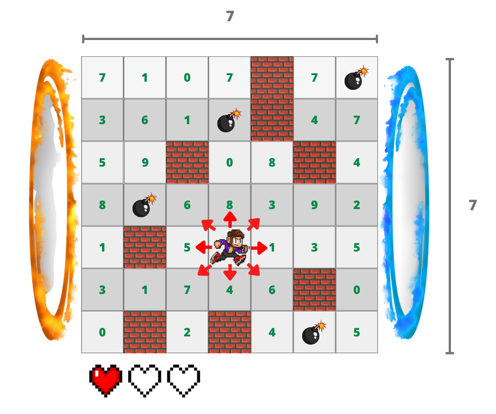
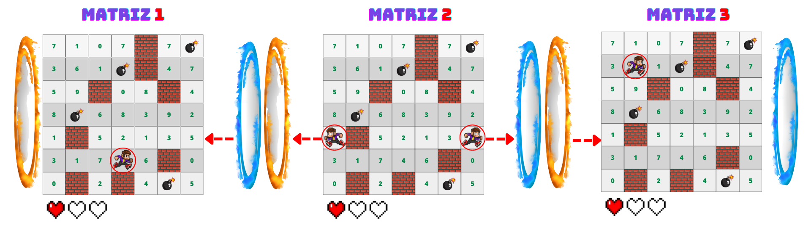

# Labirinto Recorrente

  
  
  

 

 

 

# ⚠️ Apresentação do Problema 

     
1️⃣ Um jogador se encontra perdido em um labirinto, o qual é compreendido por nós como sendo uma matriz cujas posição de sua localização é dada por um valor (x, y) dessa estrutura. À frente é mostrado o que há nesse labirinto, juntamente com uma imagem ilustrativa a fim de proporcionar um melhor entendimento.
  
### Componentes do labirinto:
  
  - <b>🚧 Paredes (#):</b>
    - ***bloqueiam certos passos***;
    - não há muito o que fazer contra elas a não ser desviar e continuar a rota.
  - <b>💣 Perigos (*):</b>
    - ***consomem parte de sua vida***;
    - a cada passada, é subtraído 1 de vida (-💔) e os itens são zerados (-💰);
    - ao ficar sem pontos de vida o algoritmo deve parar e indicar fim de jogo;
    - os perigos são estáticos, não somem de lugar depois de serem caminhados.
  - <b>🛣️ Trajetórias:</b> 
    - ***valores positivos que devem ser subtraídos em 1 a cada passagem***;
    - caso o valor da casa seja 0 não existem itens para serem consumidos e nada é feito;
    - a regra para os "portais" é de escolha do aluno;
    - não é possível se "teletransportar" diretamente para uma parede em outra matriz; 
    - não é possível startar em um "portal" e já se "teletransportar";
    - é possível percorrer uma matriz mais de uma vez.
  - <b>💖 Vida:</b> 
    - ***o máximo de vidas é 10 (💕)***;
    - caso jogador obtenha 4 itens, estando com o máximo de vida a quantidade de itens é zerada.
  - <b>💰 Itens:</b>
    - ***a cada 4 itens coletados é ganho 1 de vida (+💖)***;
    - cada casa possui um valor (0 - 10) que consiste diretamente no quantidade de itens que possui;
    - caso a casa possua o valor 0 ela não possui itens.
  - <b>🌀 Portais:</b>
    - ***as EXTREMIDADES da ESQUERDA (círculo laranja) e da DIREITA (círculo azul) funcionam como "portais"***;
    - ao saltar em um portal o jogador é teleportado para um lugar aleatório de outra matriz (com exceção de paredes);
    - ao chegar na extremidade esquerda o jogador volta para a matriz anterior;
    - ao chegar na extremidade direita o jogador avança para a matriz posterior;
    - caso esteja na primeira matriz e encoste na extremidade esquerda o jogador pula para a última matriz;
    - caso esteja na útima matriz e encoste na extremidade direita o jogador pula para a primeira matriz;

 

<em>Imagem 1: Imagem representativa do labirinto e seus componentes.</em>

2️⃣ O jogador começa o jogo com um número determinado de vidas e deve percorrer a matriz de forma aleatória. A cada movimento, o jogador pode se deslocar para uma das oito direções possíveis (cima, baixo, esquerda, direita, diagonal cima esquerda, diagonal cima direita, diagonal baixo esquerda, diagonal baixo direita) desde que a nova posição não seja uma parede. Ao passar por uma posição que contenha um item, o jogador coleta o item e diminui em 1 a quantidade de itens daquela posição. Caso o jogador perca todas as suas vidas, o jogo acaba e é salvo um arquivo com os dados da jogada.

 

<em>Imagem 2: Imagem representativa das possíveis ações no labirinto.</em>

3️⃣ O labirinto deve ser lido do arquivo [input.data](), o qual apresentará várias matrizes, todas quadráticas conforme já exposto. 

4️⃣ Sua missão é percorrer as matrizes até que todo o caminho percorrido pelo garoto se torne zero ou que ele venha a morrer devido aos perigos enfrentados. 

5️⃣ Ao fim da aplicação é preciso apresentar como resultado: 

    🔹 (A) Quantas casas foram percorridas ao todo; 
    🔹 (B) Qual a soma de itens consumidos pelo caminho; 
    🔹 (C) Quantas casas da matriz ficaram sem serem exploradas; 
    🔹 (D) Quantos perigos foram enfrentados ao decorrer do percurso.

📝 <b>Observação:</b> A intenção global do problema não é encontrar uma saída, mas sim, tentar consumir o máximo possível de itens até chegar a zerar as possibilidades desse tipo ou morrer tentando.

# 💡 Solução do Problema

O código contém algumas funções principais que regem funcionamento do programa, sendo elas:
  
  - A função <code>tokenizarMatriz</code> é responsável por separar os valores da matriz em tokens, utilizando o delimitador espaço (" "). Dependendo do valor do token, é atribuído um valor numérico correspondente a cada elemento da matriz. Se a matriz passada como argumento for um espelho, a função também atribui valores aos elementos da matriz de espelho.
  - Seguindo essa ideia, a função <code>tokenizarLinha</code> é responsável por separar os valores da primeira linha do arquivo em tokens, utilizando o mesmo delimitador espaço (" "). Esses valores representam o número de linhas e colunas da matriz.
  - Adiante, a função <code>readFile</code> é responsável por abrir o arquivo com as matrizes e ler suas informações. A função utiliza a função <code>fgets</code> para ler cada linha do arquivo e passa cada linha como parâmetro para as funções <code>tokenizarLinha</code> e <code>tokenizarMatriz</code>, conforme necessário. A função também cria arquivos de checkpoint para salvar as informações lidas.
  - Posteriormente, a função <code>readCheckpoint</code> é responsável por ler as informações salvas no último arquivo de checkpoint criado para a matriz.
  - Juntamente, a função <code>readCheckpointEspelho</code> é responsável por ler as informações salvas no último arquivo de checkpoint criado para a matriz de espelho.
  - Em seguida, a função <code>percorrerMatriz</code> recebe como argumentos um ponteiro para um objeto do tipo <code>Dados</code>, um ponteiro para um objeto do tipo <code>Espelho</code>, e três ponteiros inteiros que armazenam, respectivamente, a quantidade de itens coletados, a quantidade de perigos encontrados e a quantidade de vidas ganhas pelo jogador. A função é responsável por executar o loop principal do jogo, onde a cada iteração é gerado um número aleatório que indica a direção do próximo movimento do jogador. Dependendo da direção escolhida, o jogador pode se mover para uma nova posição na matriz, coletar itens, perder vidas, ou ser teleportado para um novo checkpoint na matriz. A cada iteração do loop, a função também atualiza a posição do jogador na matriz, verifica se o jogo acabou e, caso necessário, salva os dados da jogada em arquivos.
  - Ao final através das funções <code>createOutput</code> e <code>createRelatorio</code> são gerados, respectivamente, os arquivos de saída <code>output.data</code> e <code>relatorio.data</code>, onde são mostrados, respectivamente, o caminho percorrido pelo jogador na matriz (matriz atual, vidas restantes, posição na matriz) e os resultados exigidos previamente (casas percorridas e não percorridas, perigos enfrentados e itens consumidos).

# 🎯 Conclusão

### ❓ Qual o custo computacional ❓ É uma solução viável ❓

  
  Em relação ao custo computacional, alguns pontos devem ser destacados. A função <code>percorrerMatriz</code> contém um loop principal que é executado até que o personagem alcance a borda da matriz. Dentro desse loop, há uma estrutura de controle de fluxo <code>switch-case</code> que seleciona a próxima posição do personagem. Além disso, a função contém várias verificações condicionais para evitar que o personagem ultrapasse a borda da matriz ou colida com obstáculos. Essas operações possuem complexidade O(1), ou seja, são operações simples que possuem um tempo de execução constante.

  No entanto, a função também possui algumas operações que possuem uma complexidade maior. A leitura e escrita de arquivos, que são realizadas pelas funções <code>readCheckpoint</code>, <code>createCheckpoint</code>, <code>readCheckpointEspelho</code> e <code>createCheckpointEspelho</code>, possuem um custo computacional que depende do tamanho dos arquivos envolvidos. Como não sabemos o tamanho exato desses arquivos, não é possível determinar o custo computacional dessas operações.

  Além disso, a função <code>percorrerMatriz</code> contém um loop <code>while</code> que é executado até que o jogo termine. Dentro desse loop, há uma verificação condicional que testa se o personagem colidiu com um obstáculo. Caso isso aconteça, é verificado se o personagem ainda possui vidas. Se sim, a posição do personagem é reiniciada e o jogo continua. Caso contrário, o jogo é encerrado. Essa verificação é feita a cada iteração do loop, o que pode aumentar o tempo de execução da função.
  
  Em geral, o custo computacional da função <code>percorrerMatriz</code> pode ser considerado moderado, com operações simples e operações mais complexas que podem aumentar o tempo de execução dependendo do tamanho dos arquivos envolvidos e do número de iterações do loop <code>while</code>.

  Portanto, o custo computacional dessas funções é bastante razoável, já que elas realizam operações simples e o custo é proporcional ao tamanho da matriz ou do arquivo de entrada. No entanto, se as matrizes forem muito grandes ou o arquivo de entrada for muito grande, o tempo de execução pode se tornar significativo.

# 🔄 Compilação e Execução

Esse programa possui um arquivo Makefile que realiza todo o procedimento de compilação e execução. Para tanto, temos as seguintes diretrizes de execução:

| Comando                |  Função                                                                                               |                     
| -----------------------| ------------------------------------------------------------------------------------------------------|
|  `make clean`          | Apaga a última compilação realizada contida na pasta build                                            |
|  `make`                | Executa a compilação do programa utilizando o gcc, e o resultado vai para a pasta build               |
|  `make run`            | Executa o programa da pasta build após a realização da compilação                                     |

## Contatos

